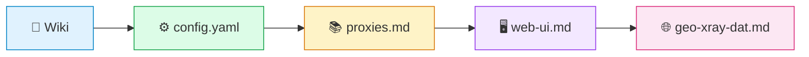

  <picture>
    <source media="(prefers-color-scheme: dark)" srcset="https://img.shields.io/badge/Mihomo-v1.19+-blue?logo=go&labelColor=1a1a2e&color=00d4aa">
    
  </picture>
  <picture>
    <source media="(prefers-color-scheme: dark)" srcset="https://img.shields.io/badge/docs-wiki-2ea44f?labelColor=1a1a2e&color=00d4aa">
    
  </picture>
  <picture>
    <source media="(prefers-color-scheme: dark)" srcset="https://img.shields.io/badge/license-MIT-f5f5f5?labelColor=1a1a2e&color=f5f5f5">
    
  </picture>
  <picture>
    <source media="(prefers-color-scheme: dark)" srcset="https://img.shields.io/badge/keenetic-gide-ff6b35?labelColor=1a1a2e&color=ff6b35">
    
  </picture>

<h1 align="center">🧭 mihomo_rus</h1>

  <b>Русскоязычное руководство по Mihomo</b> 
  <i>От первых портов до полного контроля — с нюансами для Keenetic, nfqws2 и XKeen</i>

  <a href="https://github.com/zhoel-sherk/mihomo_rus/wiki">📖 GitHub Wiki</a>
  ·
  <a href="GUIDE.md">🚀 Быстрый старт</a>
  ·
  <a href="mihomo/config.yaml">⚙️ Пример конфига</a>

---

## 📋 Что внутри

| Навигация | О чём |
|-----------|-------|
| [**📖 Wiki**](https://github.com/zhoel-sherk/mihomo_rus/wiki) — полный разбор config.yaml | General, TUN, DNS, Sniffer, Rules, VLESS, Proxy Groups, nfqws2 — всё постранично |
| [**🚀 GUIDE.md**](GUIDE.md) | Индекс с быстрым стартом и ссылками на Wiki |
| [**📄 mihomo/config.yaml**](mihomo/config.yaml) | Рабочий пример без личных узлов |
| [**📚 docs/ru/proxies.md**](docs/ru/proxies.md) | Шпаргалка по всем типам исходящих узлов |
| [**🖥️ docs/ru/web-ui.md**](docs/ru/web-ui.md) | Yacd, Metacubexd, XKeen-UI — панели управления |
| [**🧩 mihomo/examples/**](mihomo/examples/) | Фрагменты конфигов под разные сценарии |
| [**🌐 docs/ru/geo-xray-dat.md**](docs/ru/geo-xray-dat.md) | GeoSite, GeoIP, symlinks, geodata-mode |
| [**🔗 docs/ru/interop-xkeen-nfqws-mihomo.md**](docs/ru/interop-xkeen-nfqws-mihomo.md) | XKeen + nfqws2 + Mihomo — типичные конфликты |

---

## 🚀 С чего начать

1. **📖 Вики** — открывай [Wiki](https://github.com/zhoel-sherk/mihomo_rus/wiki) и читай нужный раздел
2. **⚙️ Конфиг** — бери за основу [`mihomo/config.yaml`](mihomo/config.yaml)
3. **📚 Прокси** — вставь свои узлы, сверяясь с [`docs/ru/proxies.md`](docs/ru/proxies.md)
4. **🖥️ Панель** — подключи веб-интерфейс: [`docs/ru/web-ui.md`](docs/ru/web-ui.md)
5. **🌐 Гео** — если на роутере Xray — [`docs/ru/geo-xray-dat.md`](docs/ru/geo-xray-dat.md)

---

## 🔗 Ссылки

| Ресурс | Описание |
|--------|----------|
|  | Исходники ядра и релизы |
|  | Официальная документация (русской нет) |
|  | Геобазы для Mihomo |
|  | Обвязка Mihomo для Keenetic |
|  | Веб-интерфейс для XKeen |
|  | Автоматизация подписей в XKeen |

---

<b>⚖️ Лицензия и дисклеймер</b>

 

Материалы распространяются «как есть», без гарантий.  
Вы сами отвечаете за законность использования в своей стране.

**AI-дисклеймер:** значительная часть текста подготовлена с помощью нейросетей и затем вычитана вручную.  
Полный аудит ещё впереди — баги и неточности могут встречаться.

